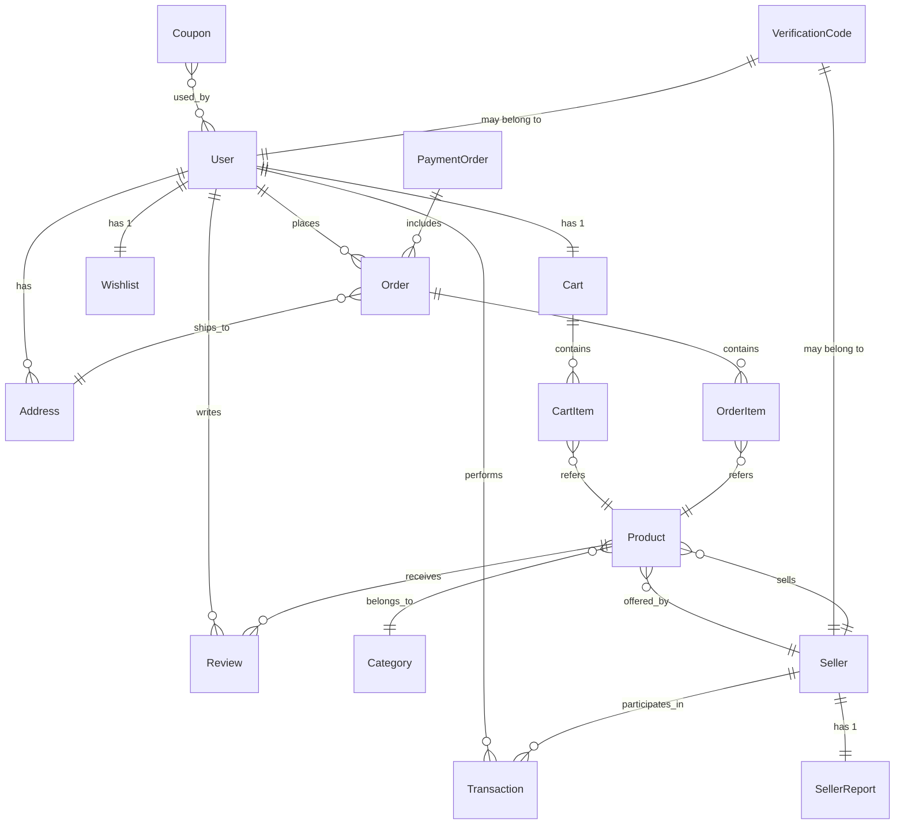
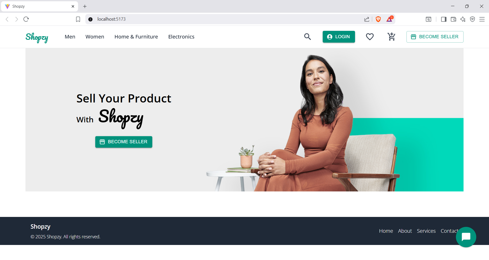
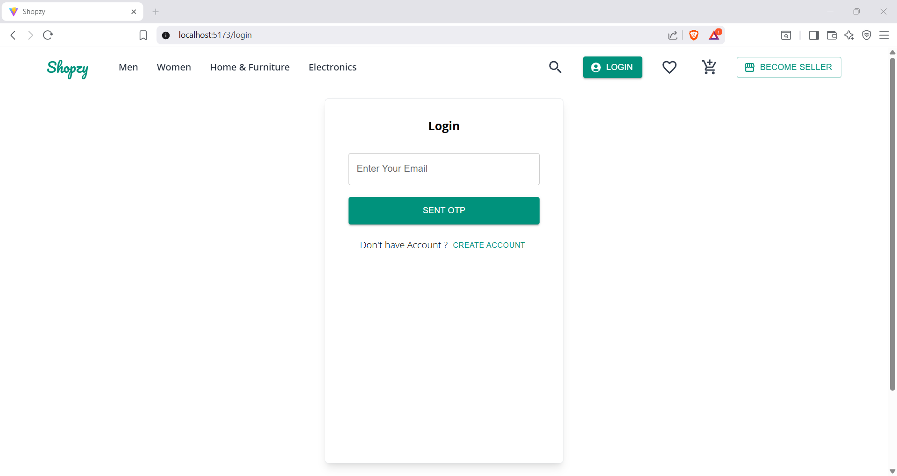

# 🛒 Ecommerce Multi‑Vendor Platform


An advanced **multi‑vendor e‑commerce** web application with a **Spring Boot** backend and a **React + TypeScript** frontend.  
Supports **customers, sellers, and admins** with authentication, product/catalog management, checkout with **Razorpay/Stripe**, analytics, and more.

---

## 📁 Monorepo Layout

```
Ecommerce-react-spring-boot/
├─ Ecomm-react-tsx-frontend/     # React + TypeScript app (Redux Toolkit, MUI, Tailwind)
└─ Ecomm-springboot-backend/      # Spring Boot REST API (JWT, Spring Security, MySQL)
```

---

## 🧰 Tools

- IntelliJ IDEA • VS Code • Node.js • MySQL

## 🧱 Tech Stack

### Backend
- Spring Boot, Spring Security, JWT
- Java Mail Sender
- MySQL (JPA/Hibernate)

### Frontend
- React (TypeScript)
- Redux Toolkit, React Router DOM, Axios
- Tailwind CSS, MUI
- React Chart
- Formik + Yup

### Payments
- **Razorpay** (India)
- **Stripe** (International)

---

## ✨ Features

### 👤 Customer
- Chatbot for queries (order history, cart, product details)
- Browse products with **filter, sort, pagination**
- Cart: add/update/remove
- Checkout: **coupons**, **addresses**, **Razorpay/Stripe**
- Orders: view/cancel
- Account management
- Wishlist (add/remove)
- Reviews & ratings

### 🛍️ Seller
- Dashboard with **earnings graphs** (today / last 7 days / last 12 months)
- Reports: sales, earnings, refunds, cancellations
- Product CRUD
- Order management
- Payment & transaction history
- Profile management

### 🛠️ Admin
- Admin dashboard
- Seller approval/suspension
- Coupon CRUD
- Home page management
- Deal/promo management

---

## 🗂️ Core Entities (ER Overview)



> _Note: Diagram is indicative; actual fields/constraints live in the code._

---

## 🚀 Getting Started

### 1) Backend (Spring Boot)

```bash
cd Ecomm-springboot-backend

# If using Maven Wrapper (recommended)
./mvnw spring-boot:run    # Linux/macOS
# or
mvn spring-boot:run       # Windows if mvnw not available
```

Create `src/main/resources/application.properties`:

```properties
spring.datasource.url=jdbc:mysql://localhost:3306/ecommerce_multi_vendor?useSSL=false&serverTimezone=UTC
spring.datasource.username=YOUR_DB_USER
spring.datasource.password=YOUR_DB_PASSWORD

spring.jpa.hibernate.ddl-auto=update
spring.jpa.show-sql=true

# JWT
app.jwt.secret=change-me
app.jwt.expiration-ms=86400000

# Mail (configure if needed)
spring.mail.host=smtp.gmail.com
spring.mail.port=587
spring.mail.username=YOUR_EMAIL
spring.mail.password=YOUR_APP_PASSWORD
spring.mail.properties.mail.smtp.auth=true
spring.mail.properties.mail.smtp.starttls.enable=true

# Payment keys (use env vars / config server for production)
razorpay.key_id=YOUR_RAZORPAY_KEY
razorpay.key_secret=YOUR_RAZORPAY_SECRET
stripe.secret_key=YOUR_STRIPE_SECRET
```

### 2) Frontend (React + TS)

```bash
cd Ecomm-react-tsx-frontend
npm install
npm run dev   # http://localhost:5173 or http://localhost:3000 depending on tooling
```

Create `.env` (example):

```env
VITE_API_BASE_URL=http://localhost:8080/api
VITE_RAZORPAY_KEY_ID=YOUR_RAZORPAY_PUBLIC_KEY
VITE_STRIPE_PK=YOUR_STRIPE_PUBLISHABLE_KEY
```

---

## 🔌 API & Integration Flow (High Level)

1. **React UI action** → 2. **Axios call to /api/** →  
3. **Spring Service + Repository** → 4. **MySQL** →  
5. **JSON response** → 6. **Redux/Component state** → 7. **Render UI**

---

## 🧪 Scripts

**Frontend**
```bash
npm run dev       # start dev server
npm run build     # production build
npm run preview   # preview production build
```

**Backend (Maven)**
```bash
mvn spring-boot:run
mvn test
mvn package
```

---

## 🛣️ Roadmap

- [x] MySQL setup
- [x] First API & entity models
- [x] Spring Security (login/signup) + JWT
- [x] Services & Controllers
- [x] API testing
- [ ] Full frontend integration
- [ ] Seller/admin advanced dashboards
- [ ] Production hardening (Docker, CI/CD, metrics, logs)

---

## 📸 Screenshots

### Homepage


### Login Page
:

---

## 🔐 Security Notes

- Store secrets in environment variables or a vault (never commit keys).
- Use HTTPS in production.
- Validate & sanitize all inputs (backend + frontend).
- Apply CORS rules to allowed origins only.

---

## 🤝 Contributing

1. Fork → create feature branch → commit → open PR.  
2. Prefer small, focused changes.  
3. Add/adjust tests when touching business logic.

---

## 📄 License

MIT — see `LICENSE` for details.
